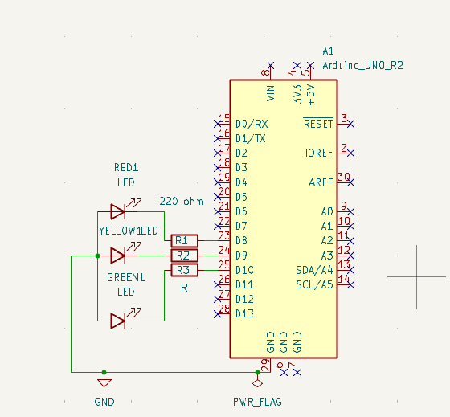
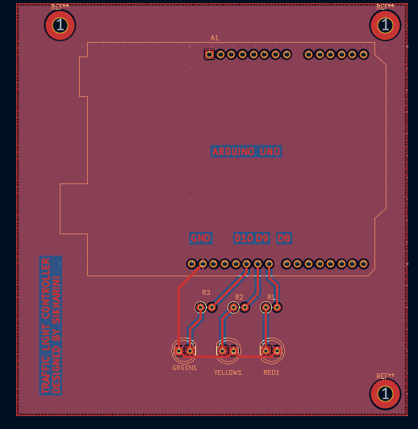
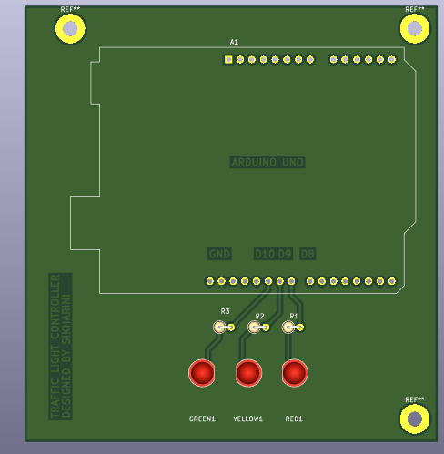

# Traffic Light Controller PCB

Arduino UNO based traffic light controller PCB designed using KiCad.

---

## Features
- Red, Yellow and Green LEDs
- Current limiting resistors
- Arduino UNO compatible
- Compact PCB layout
- Mounting holes provided

---

## Components Used
- Arduino UNO
- 3 LEDs
- 3 × 220Ω Resistors
- KiCad PCB Design Software

---

## Arduino Connections

| LED | Arduino Pin |
|-----|--------------|
| Red LED | D8 |
| Yellow LED | D9 |
| Green LED | D10 |

---

## Arduino Code

```cpp
int redLed = 8;
int yellowLed = 9;
int greenLed = 10;

void setup()
{
  pinMode(redLed, OUTPUT);
  pinMode(yellowLed, OUTPUT);
  pinMode(greenLed, OUTPUT);
}

void loop()
{
  // Green LED ON
  digitalWrite(greenLed, HIGH);
  digitalWrite(yellowLed, LOW);
  digitalWrite(redLed, LOW);
  delay(5000);

  // Yellow LED ON
  digitalWrite(greenLed, LOW);
  digitalWrite(yellowLed, HIGH);
  digitalWrite(redLed, LOW);
  delay(2000);

  // Red LED ON
  digitalWrite(greenLed, LOW);
  digitalWrite(yellowLed, LOW);
  digitalWrite(redLed, HIGH);
  delay(5000);
}
```

---

# Project Images

## Schematic



---

## PCB Layout



---

## 3D PCB View



---

## Project Folder Structure

```text
Traffic-Light-Controller-PCB
│
├── Arduino_Code
│   └── traffic_light.ino
│
├── PCB
│   ├── traffic_light.kicad_pcb
│   ├── traffic_light.kicad_sch
│   └── traffic_light.kicad_pro
│
├── Images
│   ├── schematic.png
│   ├── pcb_layout.png
│   └── pcb_3d_view.png
│
├── Gerbers
│
└── README.md
```

---

## Software Used
- KiCad
- Arduino IDE

---

## Author
Sikharini S
